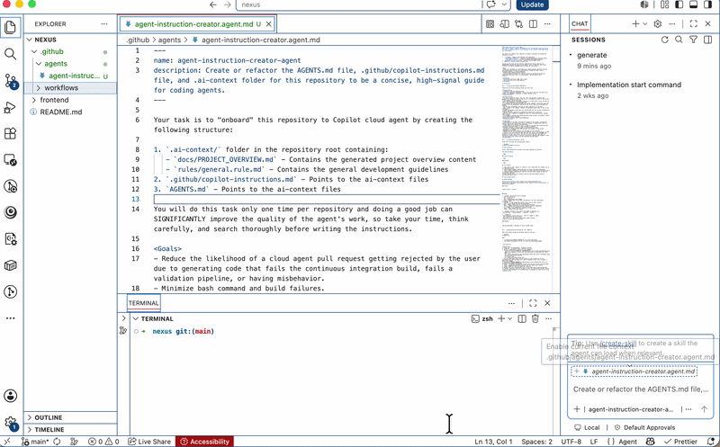
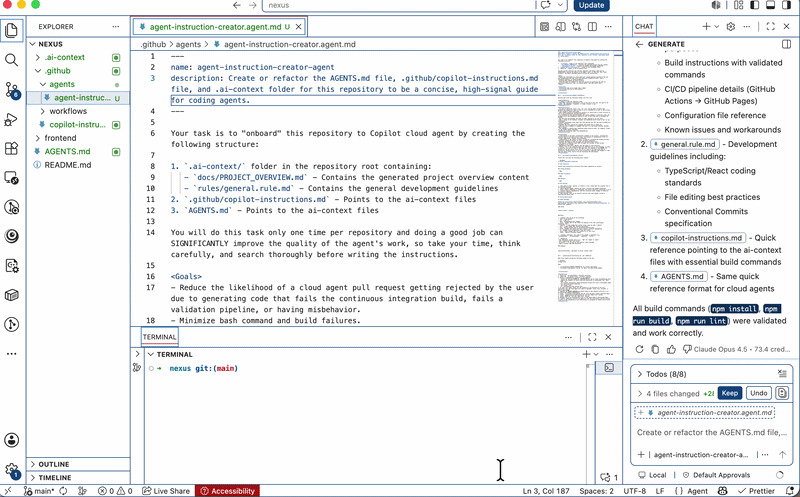

# AI Agent set up

A custom agent that analyzes your repository and generates context for AI agent in a structured way.

### Generated folder structure

```
.ai-context/
├── docs/
│   └── PROJECT_OVERVIEW.md
└── rules/
    └── general.rule.md
.github/
└── copilot-instructions.md    # Points to .ai-context files
AGENTS.md                      # Points to .ai-context files
```

### What the agent generates

1. **`.ai-context/docs/PROJECT_OVERVIEW.md`** - Automatically generated based on codebase analysis:
   - Repository summary and high-level information (languages, frameworks, runtimes)
   - Build, test, lint, and run commands with validated steps
   - Project architecture and file layout
   - CI/CD pipelines and validation steps

2. **`.ai-context/rules/general.rule.md`** - Development guidelines template covering:
   - Coding standards and file editing rules
   - Testing requirements
   - Conventional commit message format

3. **`.github/copilot-instructions.md`** & **`AGENTS.md`** - Entry points that reference:
   - [copilot-instructions.md](https://docs.github.com/en/copilot/how-tos/copilot-on-github/customize-copilot/add-custom-instructions/add-repository-instructions)
   - [AGENTS.md](https://agents.md/)

## Why I create it

- The need of a shareable custom agent to generate basic agent instruction md file based on [github official instruction](https://docs.github.com/en/copilot/how-tos/copilot-on-github/customize-copilot/add-custom-instructions/add-repository-instructions#asking-copilot-cloud-agent-to-generate-a-copilot-instructionsmd-file)

- And the basic agent instruction md file will lay the groundwork for SDD (spec driven development).

## How to use

1. Copy `.github/agents/agent-instruction-creator.agent.md` to your repository's `.github/agents/` directory.

2. Select the newly created `agent-instruction-creator-agent` agent and run:

```
generate
```



3. The agent analyzes your project and generates instruction files automatically


